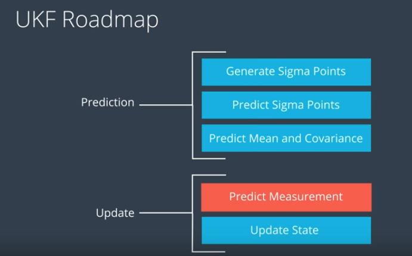

# Unscented Kalman Filter Project

In this project utilize an Unscented Kalman Filter to estimate the state of a moving object of interest with noisy lidar and radar measurements. 

This project involves the Term 2 Simulator which can be downloaded [here](https://github.com/udacity/self-driving-car-sim/releases)

## Objectives

### 1. Code must compile without errors with cmake and make. 

NOTE: since eigen printed many compile warning, I added a -w to the CMakelist.txt to clean up the output.

### 2. px, py, vx, vy output coordinates must have an RMSE <= [.09, .10, .40, .30]. 

We run ./UnscentedKF against the linux simulator: [term2_sim.x86_64](https://github.com/udacity/self-driving-car-sim/releases) from the car-nd-term2 starter kit.

Running my built application: UnscentedKF against the Udacity C++ simulator, I was able to achieve an accuracy of 

[0.0647, 0.0823, 0.3225, 0.2398] and appeared consistent within range **upon initial run and guessed deviation parameters**, i.e. starting with process noise values	std_a_ = 1 and std_yawdd_ = 1. Compared with the Extended EFK project of RSME values *[0.097, 0.084, 0.45, 0.43]*, we were able to produced better results with the UnscentedKF.

### 3. Your Sensor Fusion algorithm follows the general processing flow as taught in the preceding lessons.

The sensor fusion algorithm follows the standard pipeline:

(Credit: Udacity)

### 4. Your Kalman Filter algorithm handles the first measurements appropriately.

In the method *void UKF::ProcessMeasurement(const MeasurementPackage &measurement_pack)* of the file *ukf.cpp*, the first measurements are used under the is_initialized code block.

The two adjustable parameters were the longitudinal acceleration and yaw process noise (CTRV model). Studying the normalized innovation squared values showed lidar to have a 95% confidence around 5 and radar to be 7, sufficient to say the RSME values should be consistent.

### 5. Your Kalman Filter algorithm first predicts then updates.

In the method *void UKF::ProcessMeasurement(const MeasurementPackage &measurement_pack)* of the file *ukf.cpp*, the predict workflow is executed, the update logic is used based on the measurement type (RADAR vs LASER).

### 6. Your Kalman Filter can handle radar and lidar measurements.

Please see the UKF class with appropriate Update methods.

### 7. Your algorithm should avoid unnecessary calculations.

We followed closely the example put forth in the classwork as well as leverage Eigen::MatrixXd and Eigen::VectorXd matrix operators to reduce complexity. It maybe optional to convert the rotation normalization steps from WHILE loops to IF-ELSE blocks.

## Bonus

I played a few times with the bonus simulator and found I need quite a bit of noise to be added to catch the car: like 20% of the default values provided by the lesson. In the end, I was able to catch the car a few times. Still, more work needs to be done.

